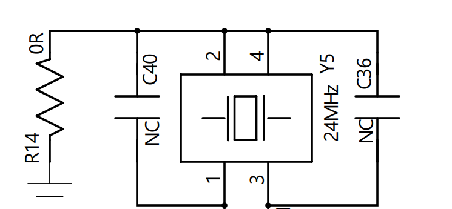
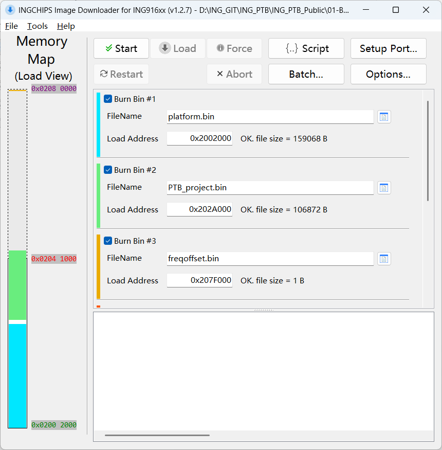
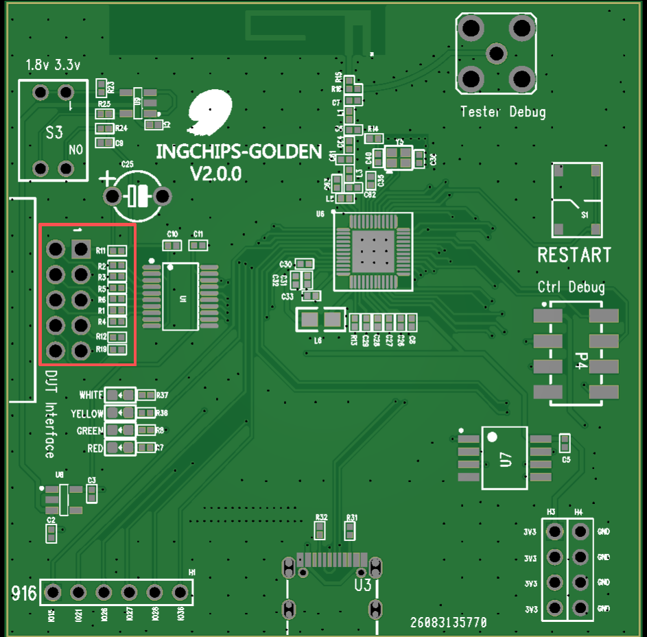
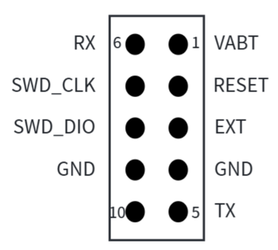
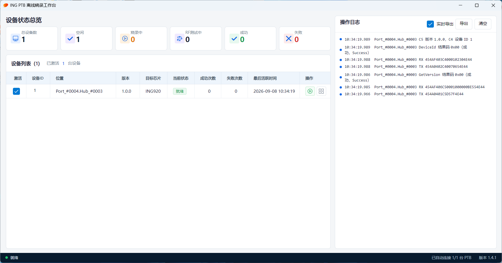
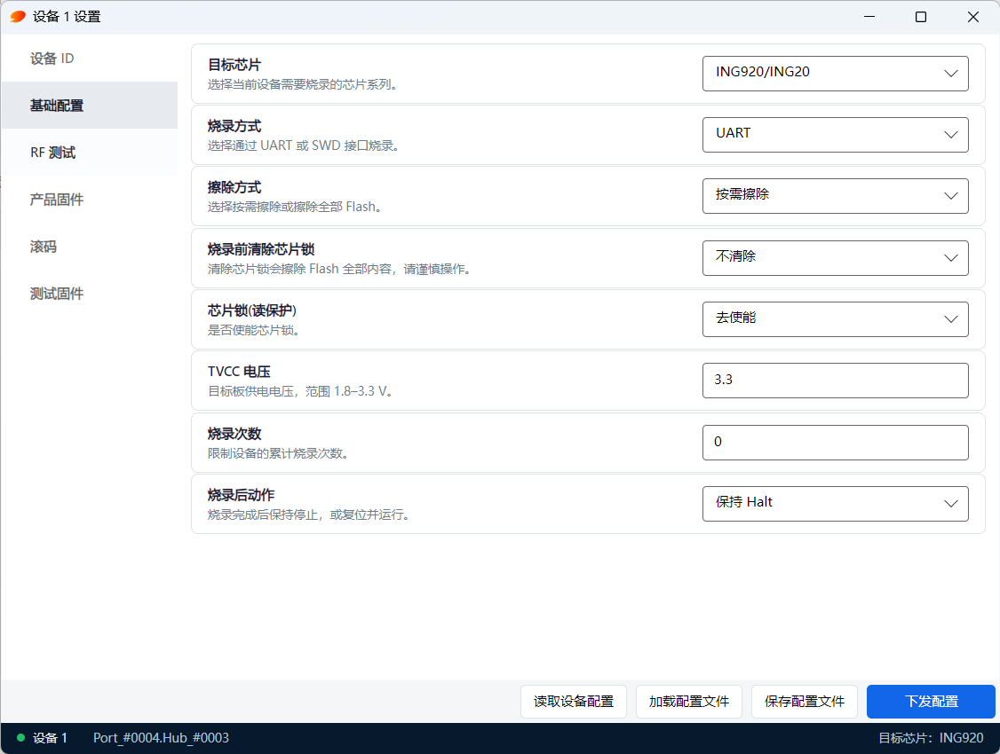
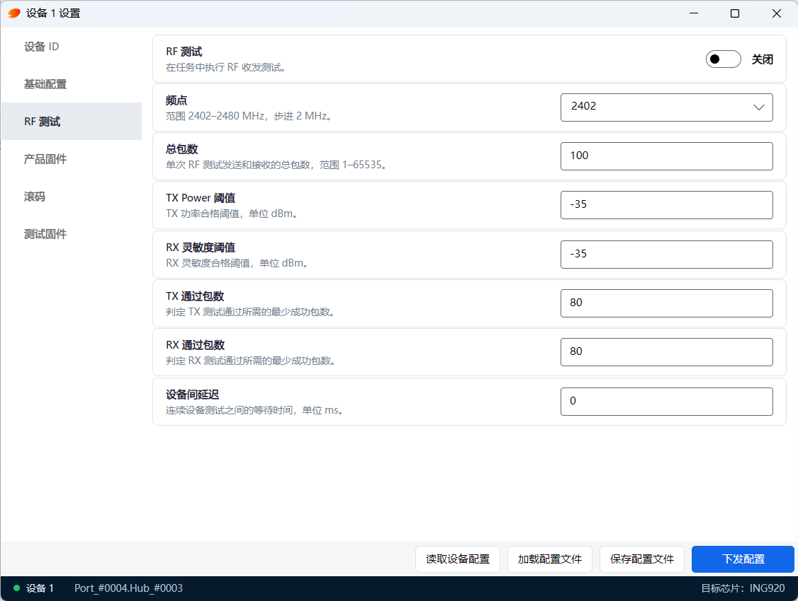
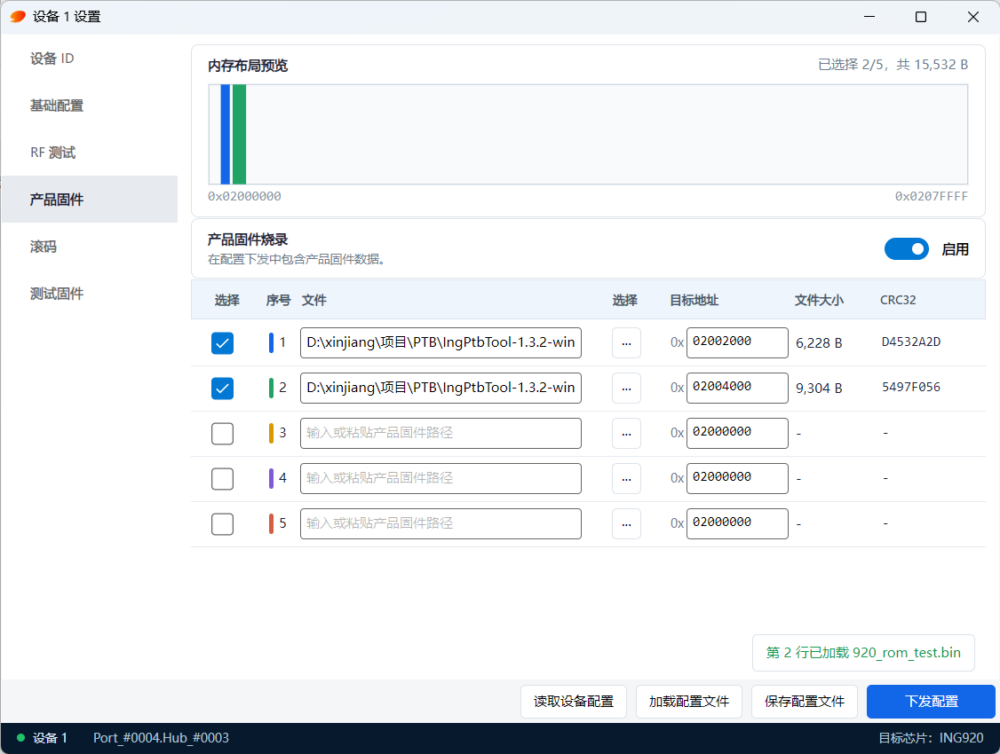
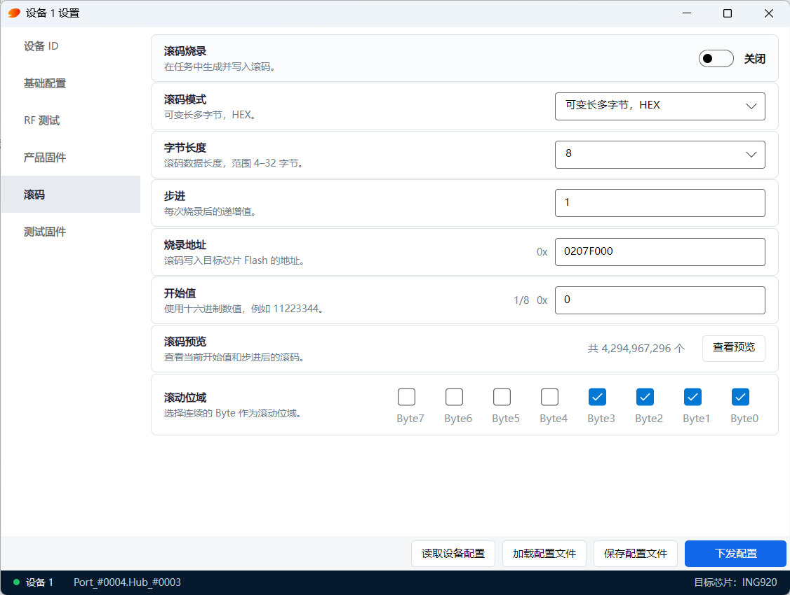
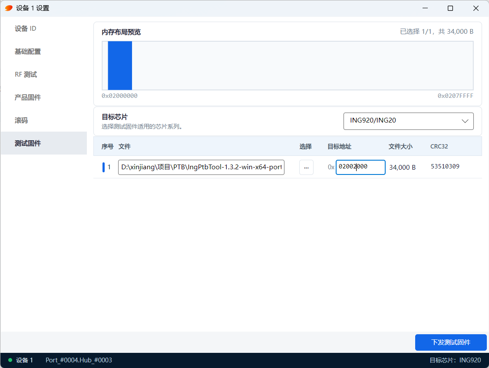

# 版本
| 文件版本 | 发布时间 | 说明 |
| ---- | ---- | ---- |
| V1.0.0 | 2026/09/08 | 首版发布 |


# 1、环境需要
## 1.1、硬件环境
* 产测烧录一体板（PTB）；
* 电脑；
* 杜邦线；
* Type-C USB 线。

## 1.2、软件环境
* PTB 上位机软件；
* 串口调试助手sscom等。

## 1.3、名词解释
* PTB：产测烧录一体板的简称；
* DUT：待测待烧录的设备，即需要接受监测的芯片/模块。

## 1.4、github 资料介绍
PTB 相关的所有资料都可以从 github 上获取：
https://github.com/munanqiu/ING_RF_Tester/tree/main

github 目录如下所示：

```
├─01-Bin for MCU                           # PTB 和 DUT 固件 
│
├─02-Tools                                 # 上位机相关工具
│              
├─03-SCH PCB                               # PTB 原理/PCB
│      
└─04-Docs                                  # 说明文档
```

# 2、环境搭建

## 2.1、PTB 频偏调整
1. 频偏测试中，PTB 通过接收 DUT 的信号来测 DUT 的频偏，需要 PTB 本身频偏正常，因此每一块 PTB 的频偏都需要单独测试并调整到 0 附近。
2. 测试过程为通过烧录 SDK 自带的 `BQB RF Test App`，在频谱仪上查看频偏，一是可以通过 `BQB RF Test App` 设置频偏值来调整，如果偏差有点大，则可以通过调整匹配电容（下图中的 C36，C40）来进行调整。

3. 如果是通过软件调整，记下调整值，修改 `01-Bin for MCU/PTB_916/freqoffset.bin` 第一个字节为实际校准值，然后烧录到 PTB 的 0x207F000 中，**PTB 在使用中请不要擦除 0x207F000，否者会引起 DUT 频偏不准确**。
4. **PTB 的频偏每年都要进行一次测试与校准。**
5. 此过程可由原厂协助完成，细节不再赘述。

## 2.2、PTB 固件烧录
PTB 的固件放置在 `01-Bin for MCU/PTB_916` 目录下。

打开 `02-Tools/downloader` 下的 icsdw916.exe 工具，通过 “file--open .ini file...” 操作导入 `01-Bin for MCU/PTB_916` 文件夹下的 `flash_download.ini` 文件，导入后界面如图：



固件分为三个：
1. `platform.bin`：platform，地址 0x2002000。
2. `PTB_project.bin`：app，地址 0x202A000。
2. `freqoffset.bin`：PTB 的频偏值，地址 0x207F000。如果是软件调频，则修改这个 bin 后，进行烧录。


在 `Setup UART` 中选择对应的串口和波特率（推荐 460800）后，点击 `start` 按键，然后让 PTB 进入 `load` 模式，就可以开始下载。


## 2.3、连线
PTB 与电脑之间通过 Type-C USB 线连接。

连接 DUT 的烧录引脚，包括 3V3，RST，EXT，GND，TX，RX，SWD_CLK，SWD_DIO 共8 跟线，如果不使用 SWD 烧录，可以不连接 SWD_CLK，SWD_DIO。如下图所示：



红框内的引脚为给 DUT 的烧录引脚，排序如下：



其他非必要引脚包括：
* PTB 调试：用于调试阶段进行烧录及 log 打印，或者更新 PTB 的固件，正式量产时不需要。
* 3.3V：一组 3.3V 电源和地，调试用。
* 5V：可以通过外部电源给线路板供电。

# 3、工作流程

PTB 使用前需要使用上位机进行配置，具体配置信息参考[上位机软件说明](#title2)。然后可以脱机或在线给 DUT 进行测试、烧录。

PTB 开始工作可由上位机或者按键触发，总体过程大致分为：芯片锁检测与解锁、射频测试、出厂固件烧录、滚码烧录、芯片锁设置，对应功能均可通过上位机打开或者关闭。最终可通过上位机在线查看结果，也可通过指示灯来判断成功失败。

## <a id="title1">3.1、射频测试</a>
射频测试前需要给 DUT 烧录测试固件，测试固件需要通过上位机配置给 PTB。PTB 给DUT 烧录玩测试固件后，开始射频测试，过程分 5 个环节：
* TX cnt：DUT发射一定包数，比如 100 包，PTB 接收，收到的包数高于某个阈值，比如 80 包认为测试通过。
* TX power：DUT 以 0dbm 发射，PTB 接收并检测信号强度，强度超过某个阈值，比如 -35dbm 认为测试通过。
* RX cnt：PTB 发射一定包数，比如 100 包，DUT 接收，收到的包数高于某个阈值，比如 80 包认为测试通过。
* RX power：PTB 以 0dbm 发射，DUT 接收并检测信号强度，强度超过某个阈值，比如 -40dbm 认为测试通过。
* Freq offset：DUT 发射信号，PTB 测试其频偏，如果发现频偏过大，PTB 会通过软件进行调试，并把调试值写入 Flash 固定地址。

TX cnt 和 TX power为对射频发射部分的评估，RX cnt 和 RX sen 为对射频接收部分的评估。

测试环境不同，正常设备测试的数据会有不同，需要根据实际情况设定合适的阈值，以实现既不会把正常设备判定成损坏，也可以把损坏的设备检测出来。


**注意：**
**1. 烧写到 DUT 的 flash 中的频偏值为 2 个字节，第一个字节是本身的频偏值，第二个字节则是频偏值本身和 0xFF 异或的值，用来给用户提供频偏值是否被篡改的校验，可以自行决定是否使用该频偏值。**
**2. 存在一定可能软件无法将频偏调到要求范围内，就需要通过调整 24M 晶振的电容来调节频偏。918 不支持软件调节频偏，因此只能通过测试结果看到当前频偏值，如果频偏较大需要调整晶振的匹配电容。** 


# <a id="title2">4、上位机软件说明</a>
上位机界面如下图所示，分别包括：设备状态总览、设备列表和操作日志。其中设备列表里面可以对 PTB 进行配置，包括：设备 ID、基础配置、产品固件、测试固件、滚码、RF 测试。

**注意：**
设备 ID、测试固件是单独下发，基础配置、产品固件、滚码、RF 测试是同时下发。



## 4.1、设备 ID
当要多个 PTB 一起使用的时候，设置不同 ID 号来区别不同的 PTB。

## 4.2、基础配置
每个参数的具体解释在配置界面有解释，注意解锁使能后，如果芯片被锁了，解锁芯片会擦除 DUT Flash 里面所有内容。


## 4.3、RF 测试
进行 RF 测试，需要先配置 DUT 测试固件。

RF 测试每个参数的具体解释在配置界面有解释，使用方法参考[射频测试](#title1)。

其中设备间延迟是为了多个 PTB 一起进行 RF 测试时，延迟启动相互错开使用的，延迟开启 RF 测试的时间为`设备 ID * 设备间延迟`。


## 4.4、产品固件
如果要烧录出厂固件，可在此页面进行配置，会和配置一起下发到 PTB。

最大可支持 5 个文件的烧录，自行选择要烧录的文件，并且填写烧录地址。


## 4.5、滚码
滚码当前仅支持 16 进制的滚动方式， 长度 4 - 32 个字节，可配任意连续字节滚动。

注意滚码烧录地址不要覆盖到应用固件，需单独划出 DUT 芯片的一页 Sector 空间来存储，例如 916、920 是 4KB，918 是 8KB。


## 4.6、测试固件
如果要进行 RF 测试，需要在此页面给 PTB 配置 DUT 的测试固件，PTB 在开始 RF 测试前，会给 DUT 烧录测试固件，若没有测试固件，则 RF 测试失败。

测试固件在 `01-Bin for MCU/DUT` 目录下，会根据芯片型号进行命名和区分，注意区别，目标芯片的配置需与测试固件一致。




# 5、重要说明

## 5.1、频偏校准
硬件的频偏可能会随着时间推移发生偏移，因此 todo 提到的频偏测试与校准，最好每年进行一次，否则可能导致产品的系统性频偏问题，如某些手机连接不上，容易断开等。
